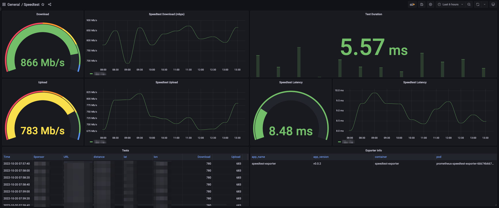

# Prometheus Speedtest Exporter

    [](https://coveralls.io/github/rtrox/prometheus-speedtest-exporter?branch=main)

Prometheus Speedtest Exporter will, when polled by Prometheus, find the closest speedtest server to your location, and perform a download test, an upload test, and a latency test, and then emits the resultos of those tests for collection by Prometheus.



## Operating the Exporter

Prometheus Speedtest Exporter has no required options, however there are several flags which can be passed to control the exporter's behavior. Note that the test typically takes 5-10 seconds to complete, which means that graceful shutdown when a test is in flight can take at least this long.

```bash
/speedtest-exporter -h
Usage of ./speedtest-exporter:
  -debug
    	sets log level to debug
  -gocollector
    	enables go stats exporter
  -graceful-shutdown
    	allow in flight speed tests to finish before shutting down (default true)
  -graceful-shutdown-timeout duration
    	graceful shutdown timeout (default 10s)
  -processcollector
    	enables process stats exporter
  -test-timeout duration
    	timeout for speedtest runs (default 10s)
```

## Running via Docker

Docker images are generated automatically by this repo when releases are created. These images are available [in Dockerhub](https://hub.docker.com/repository/docker/rtrox/prometheus-speedtest-exporter). Example Usage:

```bash
docker run -d --name speedtest-exporter -p 8080:8080 rtrox/prometheus-speedtest-exporter:v0.0.2
```

## Running via Docker Compose

A docker-compose file is provided in the root of this directory. To run, simply:

```bash
docker compose up -d
```

## Running via Kubernetes

Kubernetes manifests are provided in the [`manifests`](kubernetes/manifests) folder.

### Kustomize

If needed, change the namespace in [`kustomization.yaml`](kubernetes/manifests/kustomization.yaml), and then:

```bash
kustomize build kubernetes/manifests/ | kubectl apply -f -
```

### Manifests

As normal:

```bash
kubectl apply -n <your namespace> -f kubernetes/manifests/
```

## Example Metric Output

NOTE: dummy data in this output to prevent leakage

```prometheus
# HELP speedtest_download_speed_mbps Latency to Speedtest Server in seconds
# TYPE speedtest_download_speed_mbps gauge
speedtest_download_speed_mbps{country="United States",distance="1.0",lat="1.0",lon="-1.0",name="Anytown, USA",server_id="1",sponsor="Dat Sponsor Doh",url="http://speedtest.example.net:8080/speedtest/upload.php"} 716.7810615213976
# HELP speedtest_exporter_info Info about this speedtest-exporter
# TYPE speedtest_exporter_info gauge
speedtest_exporter_info{app_name="speedtest-exporter",app_version="x.x.x"} 1
# HELP speedtest_latency_ms Latency to Speedtest Server in seconds
# TYPE speedtest_latency_ms gauge
speedtest_latency_ms{country="United States",distance="1.0",lat="1.0",lon="-1.0",name="Anytown, USA",server_id="1",sponsor="Dat Sponsor Doh",url="http://speedtest.example.net:8080/speedtest/upload.php"} 4.13
# HELP speedtest_target_update_duration_ms Duration of speedtest runs in seconds
# TYPE speedtest_target_update_duration_ms gauge
speedtest_target_update_duration_ms 0.206249213
# HELP speedtest_test_duration_ms Duration of speedtest runs in seconds
# TYPE speedtest_test_duration_ms gauge
speedtest_test_duration_ms 6.257747472
# HELP speedtest_upload_speed_mbps Latency to Speedtest Server in seconds
# TYPE speedtest_upload_speed_mbps gauge
speedtest_upload_speed_mbps{country="United States",distance="1.0",lat="1.0",lon="-1.0",name="Anytown, USA",server_id="1",sponsor="Dat Sponsor Doh",url="http://speedtest.example.net:8080/speedtest/upload.php"} 724.4910836862521
```
